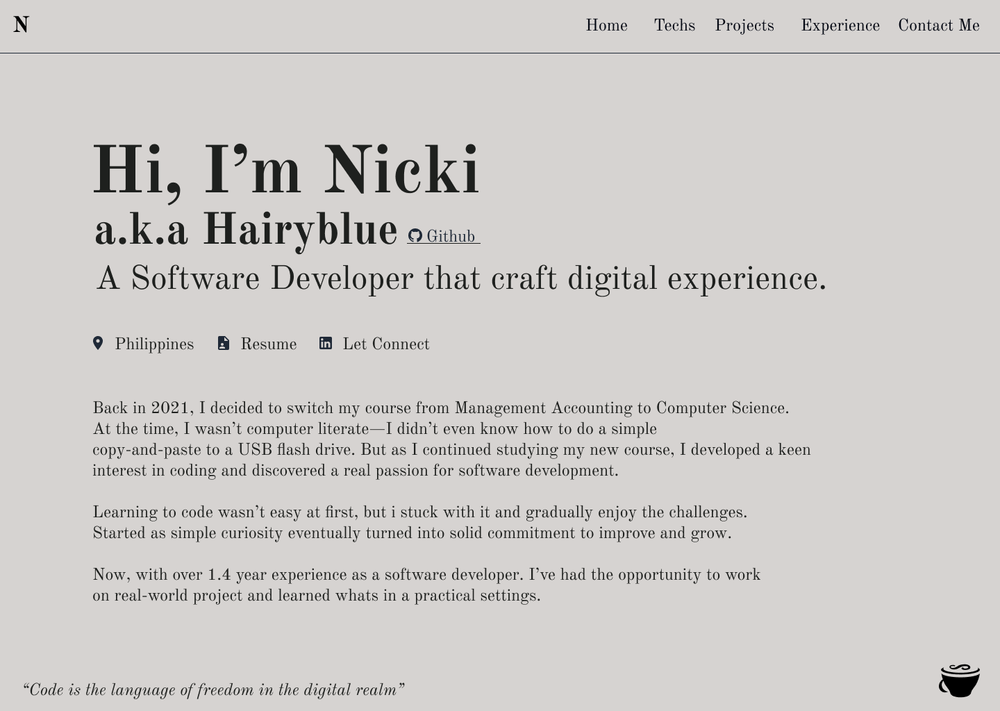

# 📄 14 kB Challenge Portfolio

## Why 14 kB?
I’m building this portfolio with a challenge: **Every page ≤ 14 kB every request.**\
Why? Because of TCP’s Initial Window (IW) defined in [RFC 6928](https://www.rfc-editor.org/rfc/rfc6928):
- IW10 = 10 × MSS (Maximum Segment Size)
- On Ethernet, MSS ≈ 1460 bytes → IW10 ≈ 14,600 bytes (~14.25 kB)
- If your critical HTML/CSS/JS fits in that window, the browser can receive it in one round trip — no extra latency waiting for ACKs.

## ⚙ How TCP Works
Before HTTP transfers data, TCP must establish a connection:
```yaml
Client                                      Server
  |                                           |
  | --- TCP SYN ----------------------------> |   (client opens TCP)
  | <--- TCP SYN+ACK ------------------------ |   (server responds)
  | --- TCP ACK ----------------------------> |   (handshake complete)
  |                                           |
  | --- HTTP GET /index.html ---------------> |   (client requests file)
  |                                           |
  | <--- HTTP/1.1 200 OK + HTML --------------|   (server sends data)
  | <--- [TCP packet: payload] -------------- |
  | <--- [TCP packet: payload] -------------- |
  | --- TCP ACKs ---------------------------- |
  |                                           |
```

## 📦 RFC 6928 IW10 in Action
MSS = Maximum Segment Size = MTU – IP header – TCP header
- Ethernet MTU: 1500 bytes
- IP header: 20 bytes
- TCP header: 20 bytes
- **MSS = 1460 bytes**

**IW10 formula:**
```yaml
min(10 × MSS, max(2 × MSS, 14600 bytes))
```
**For Ethernet:**
```yaml
10 × 1460 = 14,600 bytes (~14.25 kB)
```

## Sample IW10 Ladder Diagram
Small file (~14 kB) delivered in a single congestion window:\
The file is ≤ IW10, it’s sent in a single burst immediately after the GET — no extra RTTs waiting for ACKs.\
I’ll use MSS = 1460 B and show a ~14 kB file (≈ 10 segments) 

```yaml
Client                                                    Server
  |                                                         |
  | --- TCP SYN ------------------------------------------->|   (client opens TCP)
  | <--- TCP SYN+ACK ---------------------------------------|
  | --- TCP ACK ------------------------------------------->|   (handshake complete)
  |                                                         |
  | --- HTTP GET /index.html ------------------------------>|   (client requests file)
  |                                                         |
  | <--- HTTP/1.1 200 OK + HTML ----------------------------|   (server sends file in IW10)
  | <--- [TCP packet: 1460B] (seg 1 of 10) ---------------- |
  | <--- [TCP packet: 1460B] (seg 2 of 10) ---------------- |
  | <--- [TCP packet: 1460B] (seg 3 of 10) ---------------- |
  | <--- [TCP packet: 1460B] (seg 4 of 10) ---------------- |
  | <--- [TCP packet: 1460B] (seg 5 of 10) ---------------- |
  | <--- [TCP packet: 1460B] (seg 6 of 10) ---------------- |
  | <--- [TCP packet: 1460B] (seg 7 of 10) ---------------- |
  | <--- [TCP packet: 1460B] (seg 8 of 10) ---------------- |
  | <--- [TCP packet: 1460B] (seg 9 of 10) ---------------- |
  | <--- [TCP packet: 1460B] (seg 10 of 10) ----------------|   (~14,600B sent immediately)
  | --- TCP ACK (cumulative) ------------------------------>|
  |                                                         |
```
**Full IW10 (10 packets — each ≈ 1460 B)**
```yaml
IW10 (≈14,600 B)
+------+ +------+ +------+ +------+ +------+ +------+ +------+ +------+ +------+ +------+
|1460B| |1460B| |1460B| |1460B| |1460B| |1460B| |1460B| |1460B| |1460B| |1460B|
+------+ +------+ +------+ +------+ +------+ +------+ +------+ +------+ +------+ +------+
 seg1    seg2    seg3    seg4    seg5    seg6    seg7    seg8    seg9    seg10
(1)                                                                 (10)
TOTAL ≈ 10 × 1460 = 14,600 B (fits the initial window)
```
**How an HTML page might occupy IW10**
```yaml
IW10 (≈14.6kB capacity)
+--------------------+-----------------+------------------+------------------+-------+
|   HTML (4.5 kB)    |   CSS (3.5 kB)  |  inline JS (2.5K)| small SVG(1kB) | spare |
+--------------------+-----------------+------------------+------------------+-------+
  ≈4500B               ≈3500B             ≈2500B             ≈1000B          ≈3100B
(HTML+CSS+JS+SVG ≈11.5kB → fits in IW10)
```

## How this this segment calculated:
Let say
- Lets Assumes MSS = **1460 bytes**
- File size = 14 kB = 14 × 1024 = **14,336 bytes**
```yaml
Number of sergment [file size / MSS] => 14,336 / 1460 = 9.82  ≈ 10
```

## What happens when the file is larger than ~14 kB (so it cannot fit wholly inside IW10 for initial burst).
Let say ~28 kB file (≈ 20 segments) 
```yaml
Client                                           Server
  |                                                |
  | --- TCP SYN ------------------------------->   |   (1) handshake start
  | <--- TCP SYN+ACK ---------------------------   |
  | --- TCP ACK -------------------------------->  |   (handshake complete)
  |                                                |
  | --- HTTP GET /big-file --------------------->  |   (client requests file)
  |                                                |
  | <--- DATA [1460B] (seg 1 of 20) -------------  |
  | <--- DATA [1460B] (seg 2 of 20) -------------  |
  | <--- ...                                       |
  | <--- DATA [1460B] (seg10 of 20) ------------   |   (~14,600 B sent = IW10)
  |                                                |
  | --- TCP ACK (ack for segs 1–10) -------------> |   (client ACKs initial window)
  |                                                |
  | <--- DATA [1460B] (seg11 of 20) -------------  |
  | <--- DATA [1460B] (seg12 of 20) -------------  |
  | <--- ...                                       |
  | <--- DATA [1460B] (seg20 of 20) ------------   |   (remaining ≈ 10 segments sent after ACK)
  | --- TCP ACK (final/cumulative) ------------->  |
  |                                                |
```

- MSS ≈ 1460 B, IW10 = 10 × MSS ≈ 14,600 B.
- A ~28 kB file → ~20 segments (28,000 / 1,460 ≈ 19.2 → 20 segments).
- First burst: server sends segments 1–10 immediately (fits in IW10).
- Then server must wait for ACK(s) before safely increasing the congestion window to send more — so the remaining segments (11–20) are sent after the ACK arrives.
- That wait introduces an extra RTT (round-trip time) before the rest of the file arrives. On slow networks (e.g., 600 ms RTT), that extra RTT can add ~600 ms to perceived load time.


## 🛠 My Build Process
I use Vite as my build tool and bundler to:
- Minify JavaScript, CSS, and HTML
- Optimize imports and tree-shake unused code
This ensures each page’s critical resources fit inside TCP’s IW10 limit for the fastest possible first load.

## 🚀 Why this matters for performance
- On slow networks (e.g., 2G at 600+ ms RTT), avoiding extra RTTs is critical.
- If your first response fits in IW10, the user sees the page as soon as the first burst arrives.
- That’s why my target is ≤ 14 kB for every page request.

# See Figma Design
